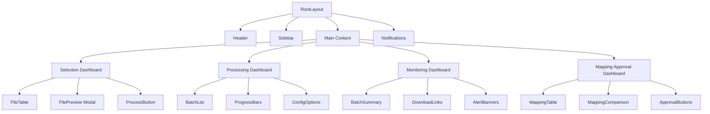
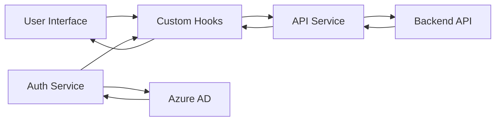

# SmartBDX Frontend Architecture Plan

## 1. Project Overview

SmartBDX is an enterprise data ingestion platform for processing complex Excel bordereaux files in insurance/reinsurance. The frontend will be built with:

- **Framework**: Next.js with TypeScript
- **UI Libraries**: Combination of Ant Design and Material UI
- **API Integration**: Custom hooks with fetch API
- **Authentication**: Azure AD integration
- **Styling**: Tailwind CSS (already configured)

## 2. Folder Structure

```
src/
├── app/                      # Next.js App Router
│   ├── (auth)/               # Authentication routes
│   │   └── login/            # Login page
│   ├── selection/            # Selection dashboard
│   ├── processing/           # Processing dashboard
│   ├── monitoring/           # Monitoring dashboard
│   ├── mapping/              # Mapping approval dashboard
│   ├── layout.tsx            # Root layout with navigation
│   └── page.tsx              # Home/landing page
├── components/               # Reusable components
│   ├── layout/               # Layout components
│   │   ├── Sidebar.tsx       # Navigation sidebar
│   │   ├── Header.tsx        # App header with branding
│   │   └── UserMenu.tsx      # User profile/avatar menu
│   ├── selection/            # Selection page components
│   ├── processing/           # Processing page components
│   ├── monitoring/           # Monitoring page components
│   ├── mapping/              # Mapping page components
│   └── common/               # Common UI components
│       ├── StatusBadge.tsx   # Status indicators
│       ├── FilePreview.tsx   # File preview modal
│       └── Notifications.tsx # Notification system
├── hooks/                    # Custom React hooks
│   ├── useAuth.ts            # Authentication hook (Azure AD)
│   ├── useApi.ts             # API request hook
│   └── useTheme.ts           # Theme switching hook
├── services/                 # Service layer
│   ├── api.ts                # API client
│   ├── auth.ts               # Auth service
│   └── mock.ts               # Mock data for development
├── types/                    # TypeScript type definitions
│   ├── file.ts               # File-related types
│   ├── batch.ts              # Batch processing types
│   ├── mapping.ts            # Mapping-related types
│   └── api.ts                # API response types
├── utils/                    # Utility functions
│   ├── formatters.ts         # Data formatters
│   ├── validators.ts         # Validation helpers
│   └── errorHandlers.ts      # Error handling utilities
└── styles/                   # Global styles and theme
    ├── theme.ts              # Theme configuration
    └── globals.css           # Global CSS
```

## 3. Component Architecture

Component hierarchy:



## 4. Data Flow Architecture



## 5. Page-by-Page Implementation Plan

### 5.1. Navigation & Layout

- Create a responsive layout with sidebar/topbar navigation
- Implement branded header with logo and app name
- Add user profile/avatar menu with placeholder for Azure AD integration
- Implement responsive design with mobile breakpoints

### 5.2. Selection Dashboard

- Enhance the existing table with:
  - Status indicators (color-coded badges)
  - Search and filter functionality
  - Checkbox row selection
  - Preview button for each file
  - "Process Selected" button

### 5.3. Processing Dashboard

- Create a list view of batch jobs with:
  - Progress bars for active jobs
  - Real-time updates via polling
  - Processing configuration options
  - Batch control buttons (start, pause, stop)

### 5.4. Monitoring Dashboard

- Implement visual summary of all batches:
  - Status charts and statistics
  - Error reporting
  - Completion time tracking
  - Download links for results/logs
  - Alert banners for failed/stalled jobs

### 5.5. Mapping Approval Dashboard

- Create a table of files needing mapping review
- Implement side-by-side comparison of source and target columns
- Add confidence score indicators with color coding
- Create approve/reject mapping buttons
- Add bulk approve option

## 6. API Integration

We'll create a service layer for API integration with endpoints:

- `/api/files` - Get list of files
- `/api/process` - Process selected files
- `/api/status` - Get batch job status
- `/api/mapping` - Get mapping suggestions
- `/api/mapping/approve` - Approve/reject mappings

## 7. Authentication Implementation

For Azure AD integration:

- Set up MSAL (Microsoft Authentication Library) for React
- Create authentication context provider
- Implement login/logout functionality
- Add protected routes
- Handle token refresh and session management

## 8. Responsive Design Strategy

- Use Tailwind CSS for responsive utilities
- Implement mobile-first approach
- Create responsive variants of all components
- Test across different device sizes

## 9. Development Phases

### Phase 1: Core Structure and Selection Dashboard
- Set up project structure and navigation
- Enhance the existing Selection Dashboard
- Implement file preview functionality

### Phase 2: Processing and Monitoring Dashboards
- Create Processing Dashboard with batch jobs view
- Implement Monitoring Dashboard with visual summaries
- Add real-time updates and alerts

### Phase 3: Mapping Approval and Authentication
- Build Mapping Approval Dashboard
- Implement Azure AD authentication
- Add user profile and settings

### Phase 4: Polish and Optimization
- Implement light/dark theme
- Add global error handling
- Optimize performance
- Add comprehensive testing

## 10. Technical Considerations

### State Management
- Use React's Context API for global state where needed
- Leverage local component state for UI-specific state
- Custom hooks for shared logic

### Performance Optimization
- Implement virtualized lists for large data sets
- Use React.memo for expensive components
- Optimize re-renders with useMemo and useCallback

### Error Handling
- Create global error boundary
- Implement consistent error handling for API calls
- Add retry mechanisms for failed requests

### Accessibility
- Ensure WCAG 2.1 AA compliance
- Implement keyboard navigation
- Add proper ARIA attributes

## 11. Key Components Implementation

### Layout Components

#### AppLayout (Root Layout)
- Main application shell with sidebar, header, and content area
- Authentication provider wrapper
- Responsive layout with mobile breakpoints

#### Sidebar Component
- Collapsible navigation sidebar
- Active route highlighting
- Mobile-friendly design

#### Header Component
- Branded header with logo
- Notification system
- User profile menu

### Dashboard Components

#### Selection Dashboard
- Enhanced file table with status indicators
- Search and filter functionality
- File preview modal
- Batch processing controls

#### Processing Dashboard
- Batch jobs list with progress tracking
- Configuration options for processing
- Real-time updates and controls
- Advanced options for power users

#### Monitoring Dashboard
- Visual summaries and charts
- Status tracking and alerts
- Download options for results
- Error reporting and diagnostics

#### Mapping Approval Dashboard
- Mapping review interface
- Side-by-side column comparison
- Confidence score visualization
- Approval workflow controls

### Authentication Components

- Azure AD integration with MSAL
- Authentication context provider
- Protected route wrapper
- Login/logout functionality

### API Integration

- Centralized API client
- Custom hooks for data fetching
- Mock data for development
- Error handling and retry logic

## 12. Implementation Roadmap

1. **Week 1**: Project setup and core structure
   - Set up folder structure
   - Implement layout components
   - Create basic routing

2. **Week 2**: Selection Dashboard enhancement
   - Improve existing file table
   - Add search and filtering
   - Implement file preview

3. **Week 3**: Processing Dashboard
   - Create batch jobs view
   - Implement configuration options
   - Add real-time updates

4. **Week 4**: Monitoring Dashboard
   - Implement visual summaries
   - Add download functionality
   - Create alert system

5. **Week 5**: Mapping Approval Dashboard
   - Build mapping review interface
   - Implement approval workflow
   - Add confidence visualization

6. **Week 6**: Authentication and Polish
   - Implement Azure AD integration
   - Add global error handling
   - Optimize performance
   - Final testing and refinement