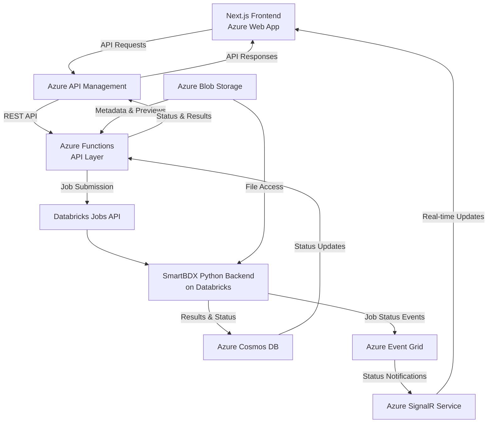
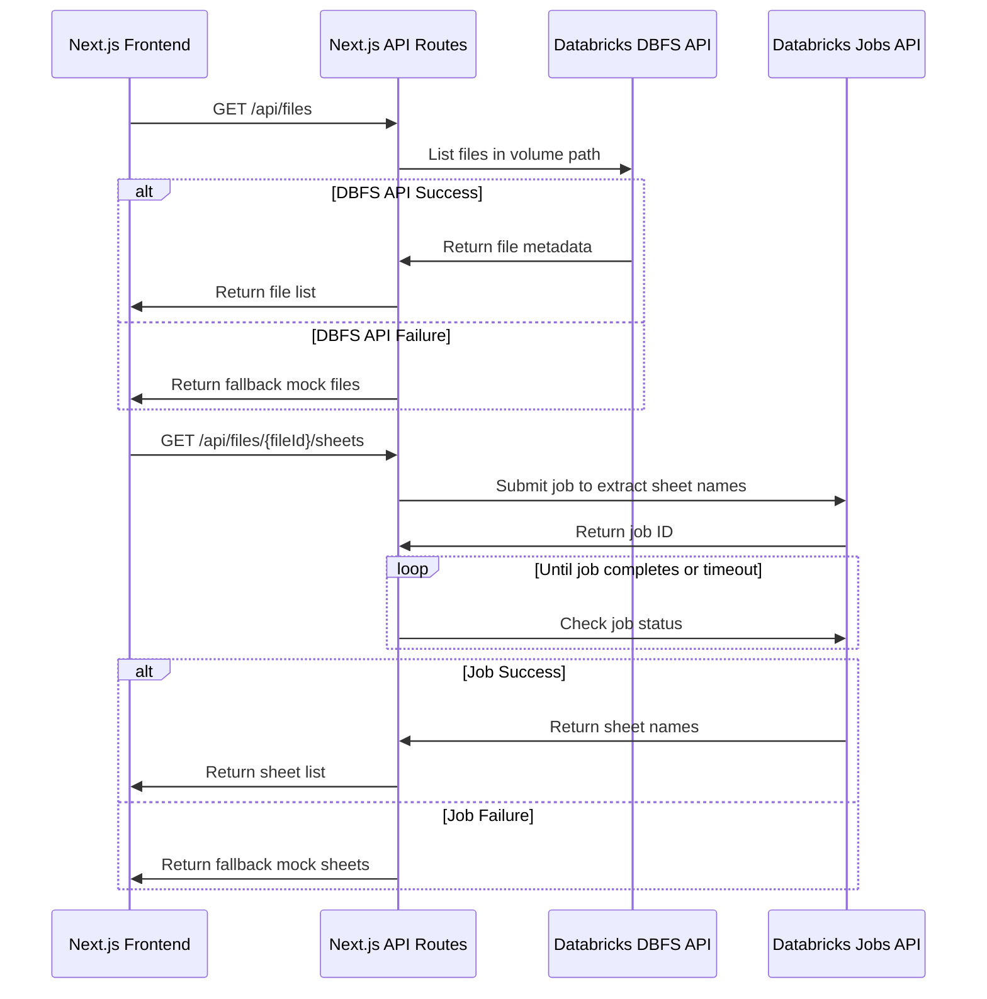
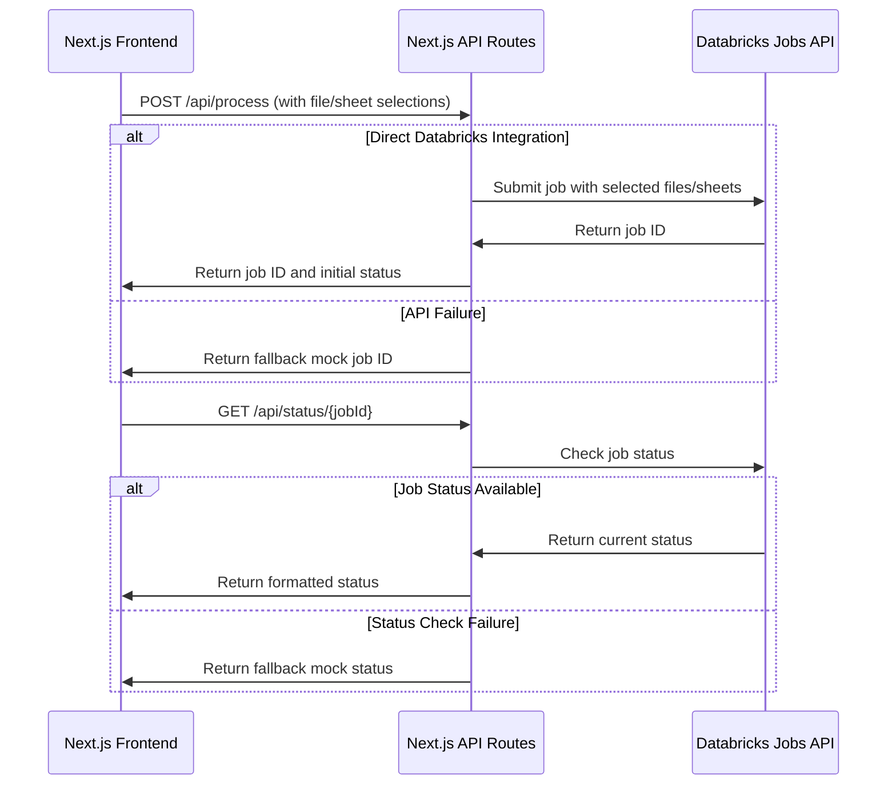

# SmartBDX Integration Plan: Performance-Optimized Azure Architecture with Databricks

Based on your requirements for performance and scalability, with files already stored in Azure Blob Storage and processed through Databricks, this integration architecture optimizes for processing 10-20 Excel files (5-50MB each) in parallel while leveraging your existing Azure infrastructure.

## Updated Implementation Status

The current implementation uses a direct Databricks integration approach with a robust fallback system:

1. **Primary: Real Databricks API Integration**
   - DBFS API for file listing
   - Jobs API for sheet discovery and processing
   - Direct connection to Databricks workspace

2. **Fallback 1: Server-side Mock Data**
   - Automatically activates when Databricks API calls fail
   - Provides realistic bordereaux file examples
   - Maintains application functionality during API outages

3. **Fallback 2: Client-side Mock Data**
   - Controlled via `NEXT_PUBLIC_USE_MOCK_DATA` environment variable
   - Useful for development and testing
   - Completely bypasses server-side API calls

## 1. Architecture Overview

## 2. Key Components

### 2.1 Azure API Management
- Serves as the central gateway for all API requests
- Provides API versioning, documentation, and security
- Handles request throttling and caching for improved performance
- Enables monitoring and analytics for API usage

### 2.2 Azure Functions (API Layer)
- Lightweight, serverless API implementation
- Handles API requests from the frontend
- Translates between REST API and Databricks Jobs API
- Manages job submission and status tracking
- Provides file metadata and preview generation

### 2.3 Databricks Jobs API Integration
- Submits SmartBDX processing jobs to Databricks
- Configures job parameters and cluster settings
- Enables parallel processing of multiple files
- Provides job monitoring and control

### 2.4 Azure Blob Storage Integration
- Central storage for all Excel files
- Shared access between frontend and Databricks
- SAS token generation for secure frontend access
- Efficient file access patterns for Databricks

### 2.5 Azure Cosmos DB
- Stores processing results and status information
- Provides low-latency access to job status
- Enables efficient querying of processing history
- Scales to handle high throughput requirements

### 2.6 Real-time Updates with Event Grid and SignalR
- Event Grid captures job status changes
- SignalR pushes real-time updates to frontend
- Provides immediate feedback on processing status
- Reduces need for polling and improves UX

## 3. Integration Workflows

### 3.1 File Discovery and Sheet Selection

### 3.2 Processing Selected Files

## 4. Performance Optimizations

### 4.1 Parallel Processing in Databricks
- Leverage Databricks' built-in parallel processing capabilities
- Configure optimal cluster size based on file processing needs
- Use thread-local storage for Azure OpenAI clients
- Implement rate limiting to prevent API throttling

### 4.2 Efficient File Access
- Use DBFS API for efficient file listing
- Submit Databricks jobs for sheet name extraction
- Selectively load only required sheets based on user selection
- Implement chunked processing for very large files

### 4.3 Robust Fallback System
- Implement three-tier fallback approach:
  1. Primary: Real Databricks API integration
  2. Fallback 1: Server-side mock data when API calls fail
  3. Fallback 2: Client-side mock data when explicitly enabled
- Provide realistic mock data for development and testing
- Ensure graceful degradation during API outages

### 4.4 Frontend Optimizations
- Use virtualized lists for displaying large file collections
- Implement expandable rows for sheet selection
- Optimize rendering of large data tables
- Provide clear visual feedback on API status

## 5. Implementation Status

### Phase 1: Direct Databricks Integration ✅
- Implemented Next.js API routes for Databricks communication
- Created file listing endpoint using DBFS API
- Implemented sheet discovery using Jobs API
- Set up basic status tracking

### Phase 2: Robust Fallback System ✅
- Implemented server-side fallback to mock data
- Created realistic bordereaux file examples
- Added environment variable control for mock data
- Ensured graceful degradation during API outages

### Phase 3: Frontend Enhancement ✅
- Updated API client in frontend
- Implemented expandable rows for sheet selection
- Enhanced file selection UI
- Added comprehensive error handling

### Phase 4: Current Improvements ✅
- Resolved Databricks API connectivity issues
- Fixed Next.js API route bug with params in sheets route
- Implemented proper error handling for API failures
- Updated configuration to use correct warehouse ID
- Created comprehensive documentation for Databricks integration

### Phase 5: Future Work 📋
- Add more comprehensive error handling
- Implement unit tests for API routes
- Optimize performance for large file sets
- Add real-time status updates

## 6. Conclusion

This integration plan provides a performance-optimized architecture for connecting your Next.js frontend directly with the Databricks-based SmartBDX backend. The implementation uses a robust three-tier approach that ensures reliability while maintaining optimal performance.

The current architecture:
- Maximizes performance through direct Databricks integration
- Provides reliable operation with comprehensive fallback mechanisms
- Efficiently handles file access from Databricks volumes
- Scales to accommodate growing workloads
- Integrates seamlessly with your existing Azure infrastructure
- Maintains functionality even during API outages

The three-tier fallback approach ensures that the application remains functional under all circumstances, providing a smooth user experience while leveraging the power of Databricks for processing complex bordereaux files.