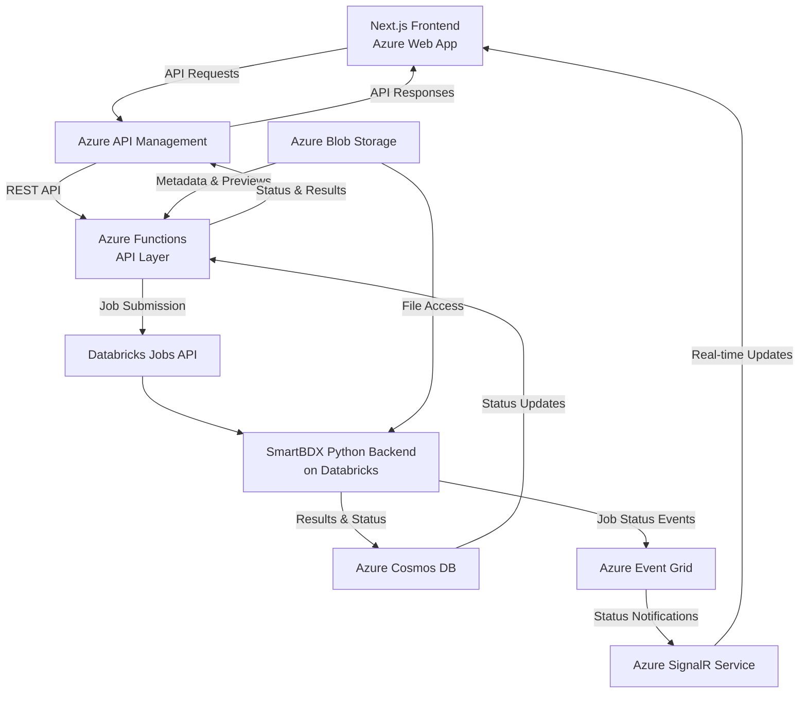
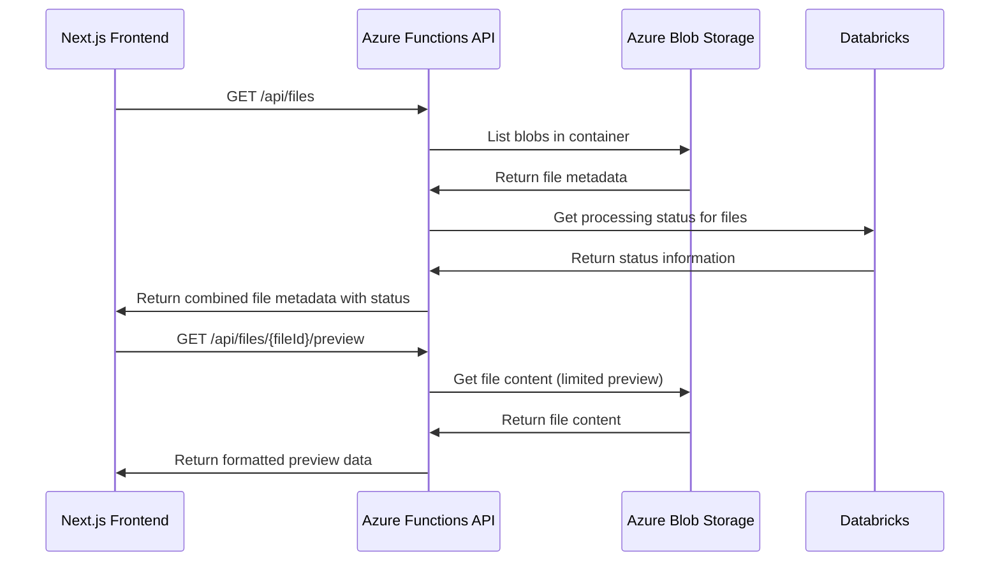
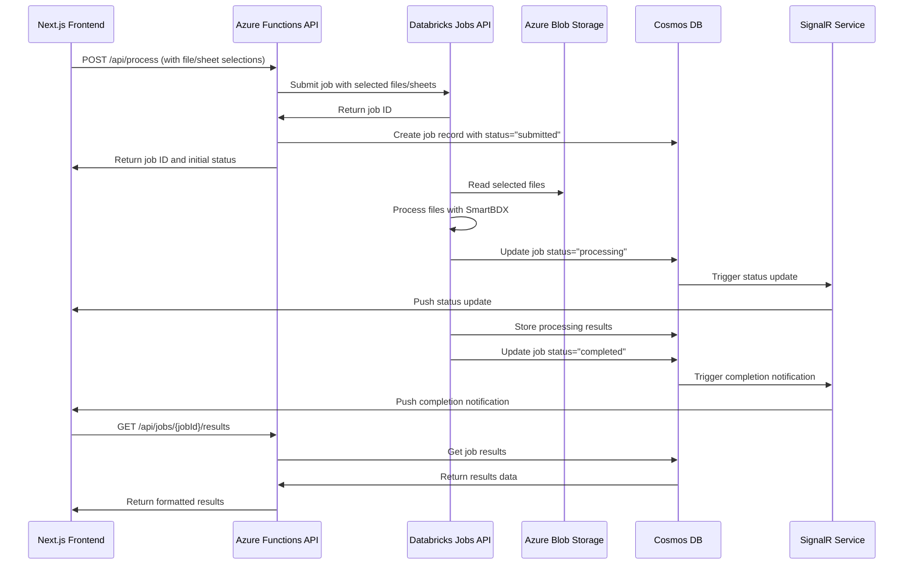

# SmartBDX Integration Plan: Performance-Optimized Azure Architecture

Based on your requirements for performance and scalability, with files already stored in Azure Blob Storage, I've designed an integration architecture that optimizes for processing 10-20 Excel files (5-50MB each) in parallel while leveraging your existing Azure infrastructure.

## 1. Architecture Overview

## 2. Key Components

### 2.1 Azure API Management
- Serves as the central gateway for all API requests
- Provides API versioning, documentation, and security
- Handles request throttling and caching for improved performance
- Enables monitoring and analytics for API usage

### 2.2 Azure Functions (API Layer)
- Lightweight, serverless API implementation
- Handles API requests from the frontend
- Translates between REST API and Databricks Jobs API
- Manages job submission and status tracking
- Provides file metadata and preview generation

### 2.3 Databricks Jobs API Integration
- Submits SmartBDX processing jobs to Databricks
- Configures job parameters and cluster settings
- Enables parallel processing of multiple files
- Provides job monitoring and control

### 2.4 Azure Blob Storage Integration
- Central storage for all Excel files
- Shared access between frontend and Databricks
- SAS token generation for secure frontend access
- Efficient file access patterns for Databricks

### 2.5 Azure Cosmos DB
- Stores processing results and status information
- Provides low-latency access to job status
- Enables efficient querying of processing history
- Scales to handle high throughput requirements

### 2.6 Real-time Updates with Event Grid and SignalR
- Event Grid captures job status changes
- SignalR pushes real-time updates to frontend
- Provides immediate feedback on processing status
- Reduces need for polling and improves UX

## 3. Integration Workflows

### 3.1 File Discovery and Selection

### 3.2 Processing Selected Files

## 4. Performance Optimizations

### 4.1 Parallel Processing in Databricks
- Implement ThreadPoolExecutor for parallel file processing
- Configure optimal thread count based on file sizes
- Use thread-local storage for Azure OpenAI clients
- Implement rate limiting to prevent API throttling

### 4.2 Efficient File Access
- Use Spark for initial file access from Blob Storage
- Implement memory-mapped file reading for large Excel files
- Selectively load only required sheets
- Implement chunked processing for very large files

### 4.3 Optimized API Responses
- Implement pagination for large result sets
- Use response compression for faster data transfer
- Cache frequently accessed metadata
- Implement efficient JSON serialization

### 4.4 Frontend Optimizations
- Use virtualized lists for displaying large file collections
- Implement progressive loading of file previews
- Use WebSockets for real-time status updates
- Optimize rendering of large data tables

## 5. Implementation Roadmap

### Phase 1: Core API Layer (2 weeks)
- Set up Azure Functions app
- Implement file listing and preview APIs
- Create Databricks job submission endpoints
- Set up basic status tracking

### Phase 2: Databricks Integration (2 weeks)
- Create Databricks notebooks for processing
- Implement parallel processing optimizations
- Set up job monitoring and status updates
- Test with sample files

### Phase 3: Frontend Integration (2 weeks)
- Update API client in frontend
- Implement real-time status updates
- Enhance file selection UI
- Add job monitoring views

### Phase 4: Performance Optimization (1 week)
- Implement caching strategies
- Optimize file access patterns
- Add pagination for large result sets
- Performance testing and tuning

### Phase 5: Testing and Deployment (1 week)
- End-to-end testing
- Load testing with realistic file sizes
- Deployment to Azure production environment
- Documentation and knowledge transfer

## 6. Conclusion

This integration plan provides a performance-optimized architecture for connecting your Next.js frontend with the Databricks-based SmartBDX backend. By leveraging Azure services like Functions, API Management, Cosmos DB, and SignalR, we can create a scalable solution that efficiently processes 10-20 Excel files (5-50MB each) in parallel.

The architecture is designed to:
- Maximize performance through parallel processing
- Provide real-time status updates to users
- Efficiently handle file access from Azure Blob Storage
- Scale to accommodate growing workloads
- Integrate seamlessly with your existing Azure infrastructure